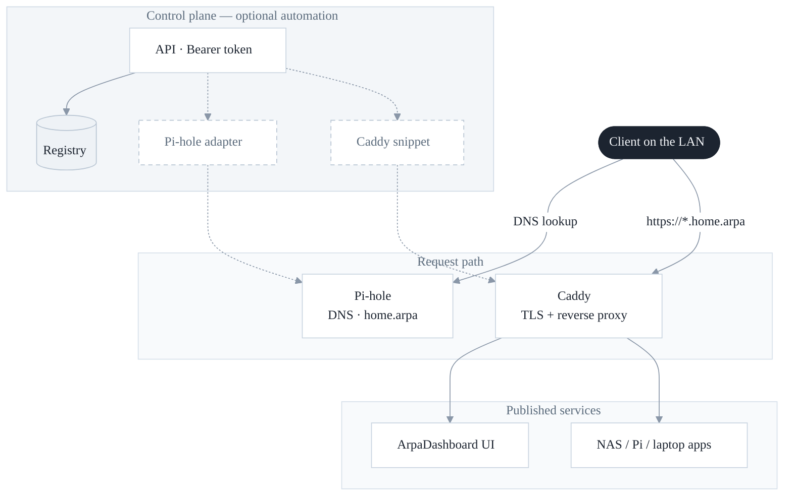

# ArpaDashboard

A small home-lab control panel for naming and publishing internal services under [`home.arpa`](https://www.rfc-editor.org/rfc/rfc8375.html) (RFC 8375)—the reserved domain for residential networks.

**Pi-hole automation:** when `PIHOLE_URL` and `PIHOLE_PASSWORD` are set, API create/update/delete **automatically** writes Local DNS. Without them, only the dashboard registry is updated. The live dashboard shows this status, and the in-app **How to** page explains setup.

## What it does

Home labs grow messy fast: containers on a NAS, Pi-hole on a Raspberry Pi, apps on a laptop, each with a different IP and port. Remembering `http://192.168.x.x:3333` does not scale, and hand-editing DNS plus reverse-proxy config for every new service is easy to get wrong.

**ArpaDashboard** gives you one place to:

1. **See what’s running** — a browser dashboard of your lab services, grouped however you like (business apps, git, NAS UIs, WIP projects, and so on).
2. **Register a service with an API** — send a protected request with a name, zone, IP, and port instead of editing Pi-hole and Caddy by hand.
3. **Wire DNS and HTTPS for you** (optional integrations) — create/update a Local DNS record in Pi-hole and write a Caddy snippet so clients reach `https://shop.dev.home.arpa` without typing a port.
4. **Separate deploy vs. development** — stable services live under `*.home.arpa`; laptop/WIP work under `*.dev.home.arpa`; experiments under `*.test.home.arpa`.

Typical flow: register `shop` on `dev.home.arpa` pointing at your Mac’s LAN IP and port → the dashboard shows a card → DNS resolves the hostname to your reverse proxy → Caddy terminates TLS and proxies to the real backend.

It is meant for **private LANs / VPNs only**, not the public internet. Use it as a reference implementation you can run on Docker next to Pi-hole and Caddy (or adapt the same pattern to your own stack).

## Naming zones

| Zone | Purpose | Example |
|---|---|---|
| `*.home.arpa` | Deployed / stable services | `nas.home.arpa` |
| `*.dev.home.arpa` | Local / laptop / WIP | `shop.dev.home.arpa` |
| `*.test.home.arpa` | Temporary / experimental | `spike.test.home.arpa` |

Do **not** invent other names under `.arpa` (for example `dev.arpa`). Only IANA/IAB add infrastructure names there. Stay under `home.arpa`.

Avoid `.local` (mDNS/Bonjour) and `.dev` (public TLD with forced HTTPS).

**DNS does not include ports.** An A record maps a name to an IP only. For `https://shop.dev.home.arpa` without `:3333`, point DNS at your reverse proxy and proxy to `ip:port`.

## Architecture (reference)



Typical pattern: names that go through the proxy resolve to your **Caddy host**; the proxy forwards to the real backend address/port.

## Quick start

```bash
cp .env.example .env
```

Generate an API key and put it in `.env` as `API_KEY` (do not commit `.env`):

```bash
openssl rand -base64 32
# or: python3 -c 'import secrets; print(secrets.token_urlsafe(32))'
```

Also set `CADDY_IP` to your reverse-proxy LAN address, and optionally `PIHOLE_URL` / `PIHOLE_PASSWORD` if you want live DNS writes.

```bash
npm install
npm run dev
```

Open `http://127.0.0.1:8787`.

Use the same value when calling the API:

```bash
export API_KEY='paste-the-generated-value-here'
```

### Register a service

```bash
curl -sS -X POST http://127.0.0.1:8787/api/services \
  -H "Authorization: Bearer $API_KEY" \
  -H "Content-Type: application/json" \
  -d '{
    "name": "shop",
    "zone": "dev.home.arpa",
    "ip": "10.0.0.50",
    "port": 3333,
    "title": "Shop admin",
    "group": "Development",
    "proxy": true
  }'
```

With `proxy: true`, DNS targets `CADDY_IP` and a Caddy route is generated for `https://shop.dev.home.arpa` → `10.0.0.50:3333`.  
With `proxy: false`, DNS targets the service `ip` directly (good for SSH or non-HTTP).

## API

Interactive docs (Swagger UI): **`/api/docs`** — OpenAPI JSON at `/api/openapi.json`.

**Agents:** step-by-step registration (health → upsert → verify → proxy) is in [`AGENTS.md`](./AGENTS.md) (also served at `/AGENTS.md` on a running instance).

All mutating routes require `Authorization: Bearer <API_KEY>`.

| Method | Path | Description |
|---|---|---|
| `GET` | `/api/docs` | Swagger UI |
| `GET` | `/api/openapi.json` | OpenAPI 3.1 document |
| `GET` | `/api/health` | Liveness |
| `GET` | `/api/services` | List registered services |
| `GET` | `/api/services/:id` | Get one service |
| `POST` | `/api/services` | Create / upsert by hostname |
| `PATCH` | `/api/services/:id` | Update |
| `DELETE` | `/api/services/:id` | Remove |

### Service fields

| Field | Required | Notes |
|---|---|---|
| `name` | yes | hostname label (`shop`) |
| `zone` | yes | one of `ALLOWED_ZONES` |
| `ip` | yes | backend IPv4 |
| `port` | if `proxy` | backend port |
| `proxy` | no | default `true` |
| `title` | no | display name |
| `description` | no | |
| `group` | no | dashboard section |
| `tags` | no | string array |
| `url_path` | no | e.g. `/admin/` |
| `protocol` | no | `https` (default) or `http` |
| `paused` | no | hide/mark inactive on dashboard |

## Docker

```bash
docker compose up -d --build
```

Bind-mount `./data` and optionally a Caddy snippet path so the proxy can import generated routes.

## Uninstall / remove

There is no uninstall binary — stop the app and optionally clean what it created.

### Stop only (keep data)

```bash
# Node: Ctrl+C in the terminal running npm run dev / npm start

# Docker
docker compose down
```

`./data` and `.env` remain on disk.

### Remove local files

```bash
rm -f .env
rm -rf data/services.json
# optional: delete the whole project directory
```

Stopping or deleting the app **does not** remove Pi-hole Local DNS rows or Caddy routes by itself.

### Clean integrations first (recommended)

While the API is still running, `DELETE /api/services/:id` (with your `API_KEY`) removes the registry entry and, when configured, updates Pi-hole and rewrites the Caddy snippet. If Pi-hole was never configured, remove matching Local DNS entries in the Pi-hole UI manually.

### Reverse proxy / portal

- Remove any Caddy `reverse_proxy` or `import` added for ArpaDashboard or generated hostnames; reload Caddy.
- If `home.home.arpa` pointed at this app, restore your previous upstream (e.g. static `file_server`).
- Delete the file at `CADDY_SNIPPET_PATH` if you used snippet mode.

### Full wipe checklist

1. Delete each service via the API (or clean Pi-hole Local DNS by hand).
2. `docker compose down` / stop Node.
3. Remove project files from the host.
4. Revert Caddy and reload.
5. Spot-check leftover names with DNS against Pi-hole.

## Security

- Keep ArpaDashboard on your LAN (or VPN). Do not expose it to the public internet.
- Generate a long random `API_KEY` (`openssl rand -base64 32`) and keep it only in `.env`.
- `home.arpa` is for internal networks only; do not request public ACME certs for it. Use Caddy’s internal CA (or your own) and trust it on clients.

## Thanks

If ArpaDashboard helped your lab, you can [buy me a coffee](https://buy.stripe.com/14A00lalU1ZS0tMauI5gc00).

Built by [BlueFate Labs](https://bluefatelabs.com/) — software engineering & applied AI.

## License

MIT © 2026 [John Hernandez](https://bluefatelabs.com/) / BlueFate Labs
